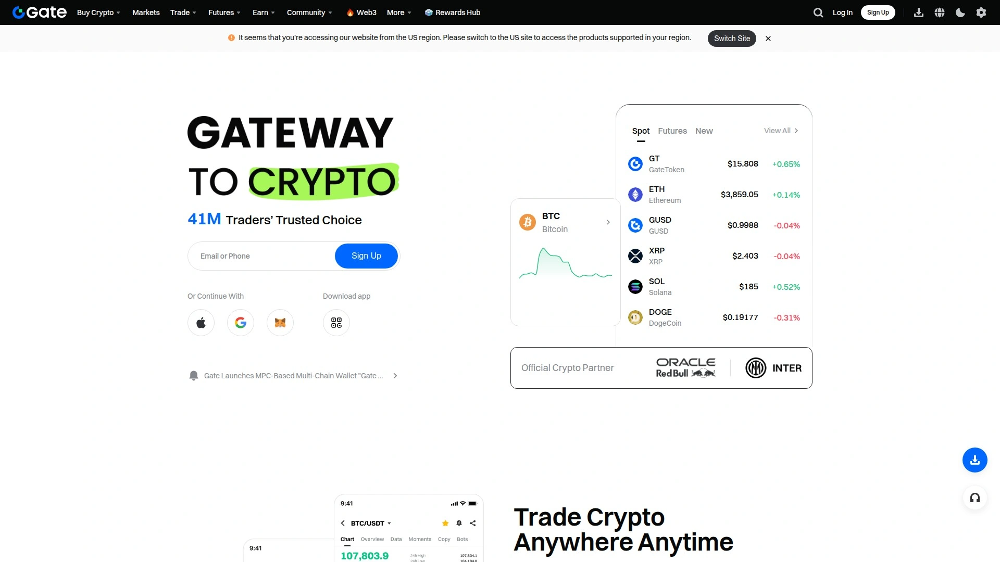
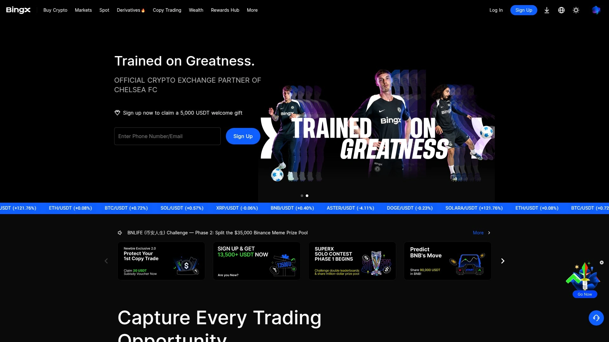

# Top 12 Crypto Derivatives Exchanges Ranked in 2025 (Latest Compilation)

Trading crypto derivatives isn't like buying a coffee at your local shop—it's more like stepping into a high-stakes poker room where the right platform can mean the difference between catching a wave and wiping out. The derivatives market hit $58 trillion in trading volume in 2024, and with Bitcoin breaking past $100,000, traders need platforms that can handle the volatility without breaking a sweat. Whether you're looking to hedge your positions, amplify your exposure through leverage, or trade perpetual contracts that never expire, finding a reliable exchange with deep liquidity and robust security matters more than ever. These platforms offer everything from 100x leverage to sophisticated order matching engines, giving both beginners and pros the tools to navigate this wild market.

***

## **[BitMEX](https://bitmex.com)**

Pioneer of crypto derivatives trading for serious market participants.

BitMEX launched in 2014 and basically wrote the playbook for cryptocurrency derivatives. They were the first to introduce Bitcoin perpetual swaps, which are now the bread and butter of crypto futures trading. The platform offers 100+ derivatives products including perpetual swaps, traditional futures, pre-launch futures, and prediction markets contracts. You can also trade 10+ spot trading pairs and convert between 30+ cryptocurrencies.

Security has been BitMEX's calling card since day one—they've never lost customer funds through hacking or intrusion. They use industry-strength cryptography with cold and hot wallet combinations, and they were actually the first exchange to publish Proof of Reserves back in 2021. Their trading interface is fully customizable with pro features like trading bots, multicharting, sub-accounts, hotkeys, and integrated news feeds.

The platform caters specifically to derivatives traders who need low latency and maximum availability. Their order matching engine processes transactions at speeds that matter when markets move fast. Registration requires identity verification, and the platform isn't available to US traders, but for eligible users worldwide, it remains a go-to choice for sophisticated derivatives strategies.

***

## **[Binance](https://www.binance.com)**

Global volume leader with unmatched liquidity across 400+ assets.

Binance handles roughly 42% of global spot trading volume and processes nearly $700 billion monthly. Their futures platform offers up to 125x leverage on Bitcoin and Ethereum, with 100x available on major altcoins like ADA, ATOM, LINK, and AVAX. The exchange supports over 400 cryptocurrencies with both USDT-margined and coin-margined perpetual contracts.

Trading fees start at 0.02% maker and 0.05% taker, with 25% discounts available when paying with BNB. Binance operates one of the most robust Proof of Reserves systems audited by Deloitte, plus their SAFU protection fund currently holds over $1 billion to protect users. The platform serves 150 million registered users across 180 countries.

The derivatives section includes perpetual futures without expiration dates and traditional quarterly futures contracts. Binance's funding rate mechanism runs every 8 hours to keep contract prices aligned with spot markets. Their mobile app and desktop interface both offer TradingView charting integration and advanced order types for managing complex positions.

***

## **[Bybit](https://www.bybit.com)**

Derivatives powerhouse with 100,000 transactions per second capacity.

Bybit built its reputation on lightning-fast execution and deep derivatives liquidity. The platform recorded $376 billion in Q3 2025 trading volume and occasionally surpasses other major exchanges in daily derivatives activity. Their order-matching engine handles 100,000 transactions per second for each contract, ensuring smooth execution even during volatile market conditions.

The exchange offers both USDT-margined perpetuals and coin-margined inverse perpetuals, plus traditional futures contracts with specific expiration dates. Leverage goes up to 100x on select trading pairs. Bybit's platform includes advanced tools like Asset Exchange for rapid spot swaps, customizable trading interfaces, and sophisticated risk management features.

After facing a security challenge in early 2025, Bybit responded with expanded insurance coverage, third-party audits, and zero-fee BTC/USDT campaigns that attracted significant institutional flow. The platform now ranks among the top five global derivatives venues with transparent reserve reporting and ongoing security enhancements.

***

## **[OKX](https://www.okx.com)**

Sophisticated derivatives suite occasionally outpacing industry leaders in volume.

OKX recorded $1.3 trillion in monthly derivatives volume in September 2025, establishing itself as a serious contender in the futures space. The platform offers both USDT-margined and coin-margined contracts, with leverage up to 125x on major pairs. Their product lineup includes perpetual futures, expiry futures (weekly and quarterly), and options trading.

The exchange's integrated wallet and DeFi dashboard create a seamless experience for traders wanting exposure beyond standard derivatives. Monthly updated Proof of Reserves lets users verify holdings against liabilities in real-time. OKX uses multi-tier cold storage and AI-based fraud detection systems to protect user assets.

Their futures trading interface supports complex strategies with cross-margin and isolated margin modes. The platform automatically rolls over perpetual contracts, so positions stay open indefinitely without forced settlement. OKX's mobile app offers full functionality with real-time P&L tracking and customizable leverage settings from 1x to 125x.

***

## **[Deribit](https://www.deribit.com)**

Options trading specialist controlling the crypto derivatives options market.

Deribit dominates the cryptocurrency options space with roughly $400 million in daily trading volume. Founded in 2016 and based in Panama, the platform specializes in Bitcoin, Ethereum, and Solana options alongside perpetual and traditional futures. In August 2025, Coinbase acquired Deribit, bringing the world's leading crypto options exchange under a major regulated umbrella.

The exchange introduced USDC-settled linear options for BTC and ETH in August 2025, complementing their existing inverse products. Options contracts let traders buy calls or sell puts at predetermined prices, while perpetual futures provide continuous exposure without expiration concerns. Fees range from -0.02% to 0.05%, with makers often receiving rebates.

Deribit's platform appeals to professional traders and institutions seeking sophisticated derivatives instruments. The interface displays detailed options chains, implied volatility data, and Greeks calculations. Since launching as a fully licensed exchange in Dubai in January 2025, Deribit operates under regulatory oversight while maintaining its focus on advanced derivatives products.

***

## **[Kraken](https://www.kraken.com)**

Regulated US presence with institutional-grade futures infrastructure.

Kraken Futures delivers a regulated derivatives trading experience with perpetual and fixed-date futures contracts. The platform matches buyers with sellers directly, meaning the exchange itself isn't a counterparty to trades. Perpetual contracts use funding rates every 8 hours to keep futures prices aligned with spot market values.

Leverage options vary by asset and account type, with both USDT-margined and coin-margined products available. Kraken's futures interface integrates TradingView charts and advanced order types including stop-losses and take-profit levels. The platform provides real-time P&L monitoring and margin level tracking to help traders avoid liquidation.

As one of the few exchanges serving US customers with futures products, Kraken maintains strong regulatory compliance and security practices. They secure 98% of assets in cold storage and provide transparent fee structures. The futures platform works seamlessly with Kraken's spot exchange, allowing easy fund transfers between accounts.

***

## **[KuCoin](https://www.kucoin.com)**

People's exchange with 520 tradable futures contracts and deep altcoin selection.

KuCoin Futures serves over 3.1 million accumulated traders with monthly trading volume exceeding $180 billion. The platform offers 520 futures contracts covering major cryptocurrencies and hundreds of altcoins. Cross-margin mode lets your entire futures account balance serve as margin for related positions, maximizing capital efficiency.

Both USDT-margined and coin-margined contracts are available, with leverage options ranging from conservative to aggressive levels. KuCoin's high-performance matching engine handles significant volume without slowdowns. Their insurance fund protects all users in case of unexpected liquidations or market events.

The futures interface includes deposits, transfers, withdrawals, and comprehensive order management tools. Customer support operates 24/7 in over 20 languages. KuCoin's futures leaderboard showcases top traders, and the platform regularly updates contract listings to include trending tokens shortly after they gain market traction.

***

## **[Bitget](https://www.bitget.com)**

Copy trading innovator with 188% reserve ratio and rapid growth trajectory.

Bitget emerged as one of the fastest-growing exchanges, ranking in the top three globally for derivatives trading by late 2025. The platform supports over 800 assets and maintains a 188% reserve ratio—meaning they hold more collateral than liabilities. This makes Bitget one of the few exchanges demonstrating surplus reserves in regular audits.

The exchange pioneered copy trading features that let users mirror strategies from experienced traders with just one click. Leverage goes up to 100x on select pairs, with both USDT-margined and coin-margined perpetual futures available. Bitget's mobile app ranks among the best in the industry for smooth functionality and real-time market data.

Futures trading includes perpetual contracts without expiration dates and traditional futures with fixed settlement periods. The platform's social trading aspect bridges the gap between novice traders and industry experts, though services remain restricted in the US. Transparent reporting and regular proof-of-reserves updates support Bitget's commitment to user protection.

***

## **[MEXC](https://www.mexc.com)**

Extreme leverage specialist offering up to 500x on major trading pairs.

MEXC stands out for providing leverage up to 500x on BTCUSDT and ETHUSDT perpetual futures, among the highest in the industry. The platform lists over 600 trading pairs with industry-leading liquidity and some of the most competitive futures trading fees. Zero maker fees on futures encourage high-volume trading strategies.

U-based perpetual futures support leverage from 1x to 500x with flexible adjustment options. MEXC's futures trading page includes comprehensive tools for position management, real-time P&L tracking, and risk control features. The platform implements funding rate mechanisms every 8 hours to maintain price stability between futures and spot markets.

With one of the fastest listing processes in crypto, MEXC often adds new tokens before other major exchanges. The trading interface works smoothly on both web and mobile, with advanced charting powered by TradingView. While extreme leverage amplifies both gains and losses, MEXC provides robust risk management tools including stop-loss orders and position size calculators.

***

## **[Gate.io](https://www.gate.com)**

Massive asset variety with 3,800+ cryptocurrencies and 737 futures pairs.

Gate.io established itself in 2013 and now offers one of the largest selections of tradable assets in crypto. The futures platform supports 737 trading pairs with $21.6 billion in 24-hour trading volume and over $23 billion in open interest. Perpetual futures dominate trading activity, though delivery futures with weekly and quarterly expirations are also available.

Trading fees start at 0.2% on spot and 0.02% on futures markets. The platform includes copy trading, trading bots, and algorithmic strategies for automated execution. Gate.io implements cold storage, multi-signature wallets, and comprehensive risk controls to protect user funds across its massive asset base.

The exchange serves users in over 130 countries but restricts access in the US and Canada. Beyond derivatives, Gate.io offers NFT trading, staking programs, crypto loans, and Gate Pay for merchant transactions. Their futures interface displays market depth, order books, and recent trades alongside integrated TradingView charts for technical analysis.

***

## **[BingX](https://www.bingx.com)**

Copy trading focused platform ranked among top 5 crypto derivatives venues.

BingX positions itself in the top 5 crypto derivatives platforms with emphasis on copy trading and user-friendly interfaces. The platform offers spot, derivatives, and wealth management products designed for both beginners and professionals. Flexible leverage options allow long or short positions across major cryptocurrencies and altcoins.

The copy trading feature stands as BingX's signature offering—users can browse comprehensive trader statistics and automatically replicate successful strategies with one-click activation. This makes derivatives trading accessible to those still learning market mechanics. The platform also supports grid trading strategies for systematic profit-taking in ranging markets.

BingX ensures rapid access to trending trading pairs with deep liquidity and competitive spreads. Their mobile app provides full functionality for managing positions on the go. The platform integrates TradingView charts and offers various order types including market, limit, and conditional orders for sophisticated trade management.

***

## **[Phemex](https://phemex.com)**

Streamlined perpetual contracts with transparent BTC and USD settlement options.

Phemex simplifies perpetual futures trading with two distinct product types: BTC-margined contracts where each contract equals $1 of Bitcoin, and USD-margined contracts with predetermined values. BTC-based futures create nonlinear profit and loss curves, while USD-based contracts operate linearly with constant rates of change.

The platform offers leverage trading on major cryptocurrencies including Bitcoin, Ethereum, XRP, Solana, and others. Phemex's perpetual contracts have no expiration date, allowing traders to hold positions indefinitely as long as margin requirements are met. Funding rates exchange between long and short holders every 8 hours to keep contract prices aligned with spot markets.

Opening positions on Phemex requires depositing crypto, converting to USDT if trading USDT futures, and transferring funds into the futures account. The mobile app makes this process straightforward with clear navigation and order placement. Market orders execute immediately at best available prices, while limit orders let traders set specific entry points.

***

## What leverage should beginners use on derivatives platforms?

Start with 3x to 5x leverage to reduce liquidation risk while learning how margin trading works. Lower leverage gives you more breathing room when markets move against your position, letting you understand funding rates, maintenance margins, and position sizing without immediately facing forced closures. Once you're comfortable reading market conditions and managing risk, you can gradually increase leverage based on your strategy and risk tolerance.

## How do perpetual contracts differ from traditional futures?

Perpetual contracts never expire—you can hold positions indefinitely as long as you maintain sufficient margin. Traditional futures have fixed settlement dates (weekly, monthly, or quarterly) when contracts automatically close. Perpetuals use funding rate mechanisms every 8 hours where longs pay shorts or vice versa, keeping contract prices anchored to spot markets. This makes perpetuals feel more like leveraged spot trading, while traditional futures require rolling positions forward if you want continued exposure.

## What's the difference between USDT-margined and coin-margined contracts?

USDT-margined contracts settle in stablecoins, making profit and loss calculations straightforward in dollar terms. Coin-margined (inverse) contracts settle in the underlying cryptocurrency, creating nonlinear P&L curves since both your position and collateral fluctuate with the asset's price. Traders preferring stable value accounting choose USDT-margined, while those wanting to accumulate more Bitcoin or Ethereum often select coin-margined products.

***

## Wrapping It Up

The derivatives landscape keeps evolving, but platforms that balance security, liquidity, and execution speed consistently rise to the top. [BitMEX](https://bitmex.com) remains particularly suitable for traders wanting deep derivatives expertise with a platform that pioneered perpetual swaps and maintains zero-loss security records since 2014. Whether you're hedging portfolios, amplifying exposure through leverage, or exploring options strategies, choosing an exchange with proven infrastructure and transparent operations makes navigating this high-stakes market significantly smoother.

[85](https://en.wikipedia.org/wiki/HTX_(cryptocurrency_exchange))
